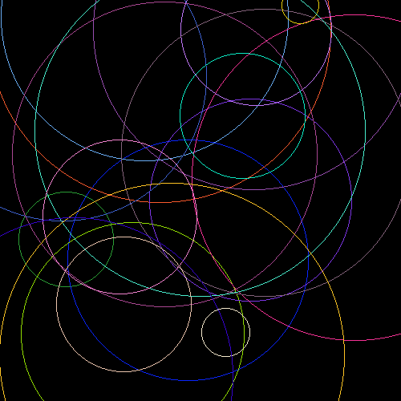
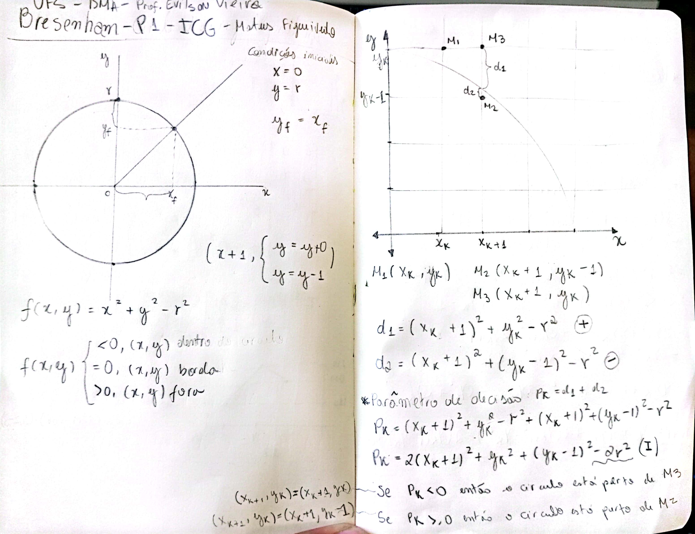
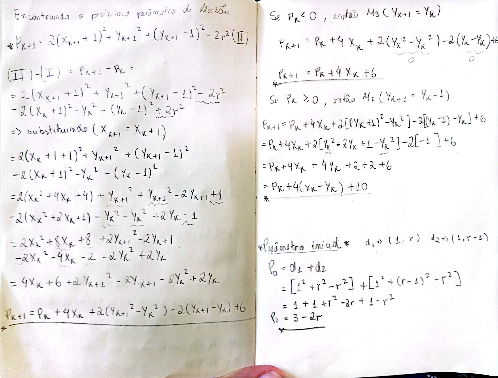

# Circunferência por ponto médio

Este projeto consiste em um programa em C para desenhar circunferências utilizando o algoritmo de Bresenham. Gerando uma imagem PPM contendo múltiplas circunferências com diferentes posições, raios e cores. Foi desenvolvido como parte do curso no Departamento de Matemática da Universidade Federal de Sergipe, sob a supervisão do Prof. Evilson Vieira.

## Compilar e Executar

```bash
gcc circ.c -o circ -lm
./circ
```

## Resultado

O programa gera um arquivo chamado `output.ppm`, que contém a imagem resultante com as circunferências desenhadas.

<div>
    
</div>

## Cálculos

<div>
    
</div>

<div>
    
</div>

## Autor

- Mateus Figueiredo Pereira
